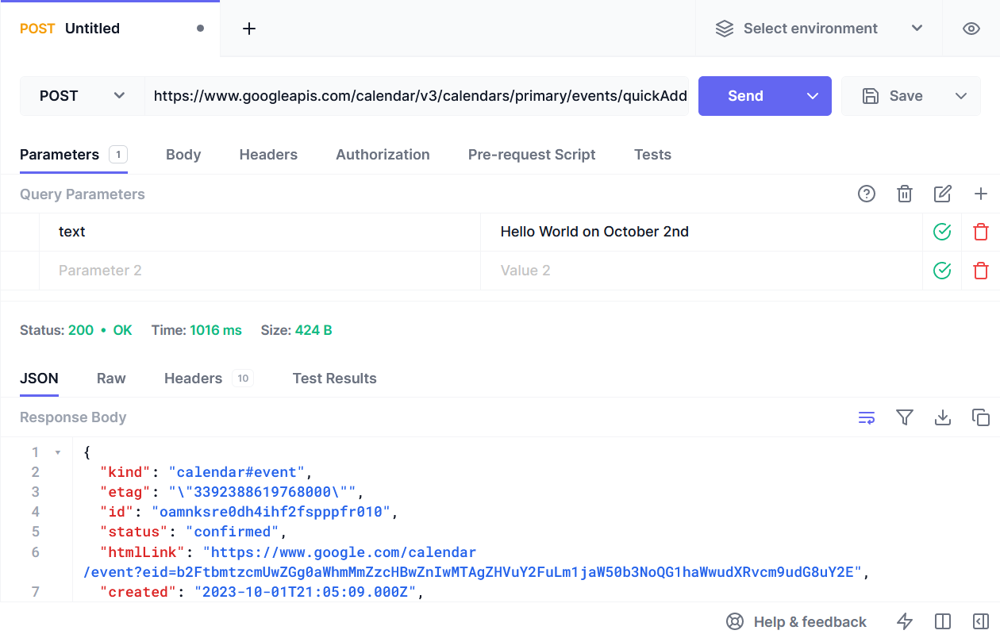
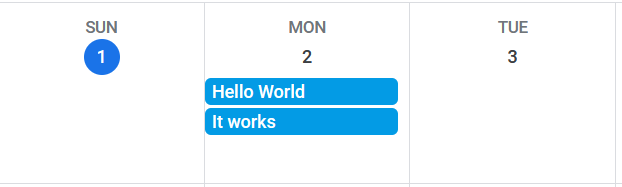

# Notetaker

### **Description of Problem Domain:**
The problem domains our team is looking to explore are the Time Management and Notetaking domains.

### **Higher Level Description of Application Type:**
Essentially, our team is looking to develop a software version of the productivity system referred to in the
book, *Getting Things Done by David Allen*. This system involves creating an initial list of items/thoughts that need to be addressed. You then clarify
each item into **Actionable** or **Not Actionable**.

**Actionable** Items are sorted into three categories:
- If it can be done in under 2 minutes, it is put into the Next Actions Section:
- If the actionable item can/should be split up into smaller tasks over time, it is put into the Projects
Section
- If it is a time sensitive item such as an appointment or event, it is scheduled into your calendar.

**Non-Actionable** Items are sorted into two categories:
- An idea that cannot be prioritized immediately is put into Someday/Maybe section.
- If it is something that will need referencing for later, it is put into the References section.

# API

We hope to use the [Google Calendar API](https://developers.google.com/calendar/api/guides/overview) to synchronize actionable events with the user’s
calendar.

Some other helpful documentation:
- https://developers.google.com/calendar/api/v3/reference/events/insert
- https://developers.google.com/calendar/api/v3/reference/events/quickAdd
- https://developers.google.com/identity/protocols/oauth2/native-app



# Example Output

```
Hello, world! 6
Client is created!
got verifier: KeJBflzK-MPo.nUm-fdKuMst71Zw96bUuO4X9t--oFA9D6mqd-OZkBuSOJnQsA3m
got authorization code: [redacted]
got authorization token: [redacted]
event creation gave 200:
{
"kind": "calendar#event",
"etag": "\"3392409413320000\"",
"id": "u2dk6hgldreh5f06r7u5qtk97k",
"status": "confirmed",
"htmlLink": "https://www.google.com/calendar/event?eid=dTJkazZoZ2xkcmVoNWYwNnI3dTVxdGs5N2sgZHVuY2FuLm1jaW50b3NoQG1haWwudXRvcm9udG8uY2E",
"created": "2023-10-01T23:58:26.000Z",
"updated": "2023-10-01T23:58:26.660Z",
"summary": "It works",
"creator": {
"email": "duncan.mcintosh@mail.utoronto.ca",
"self": true
},
"organizer": {
"email": "duncan.mcintosh@mail.utoronto.ca",
"self": true
},
"start": {
"date": "2023-10-02"
},
"end": {
"date": "2023-10-03"
},
"iCalUID": "u2dk6hgldreh5f06r7u5qtk97k@google.com",
"sequence": 0,
"reminders": {
"useDefault": false
},
"eventType": "default"
}

all done!
```


